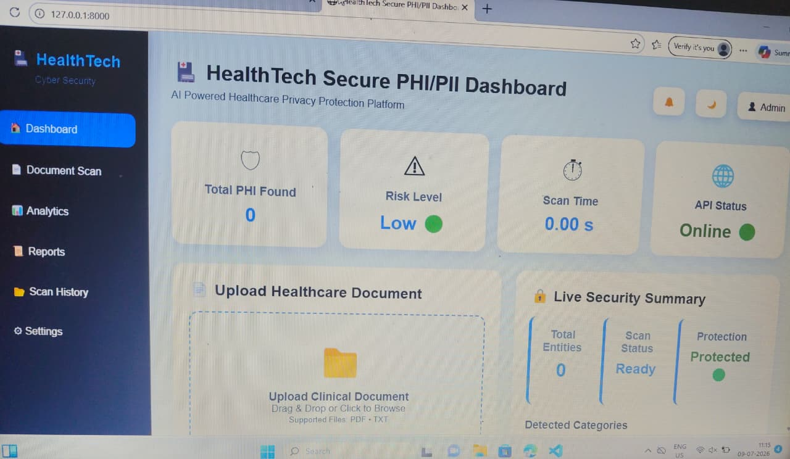
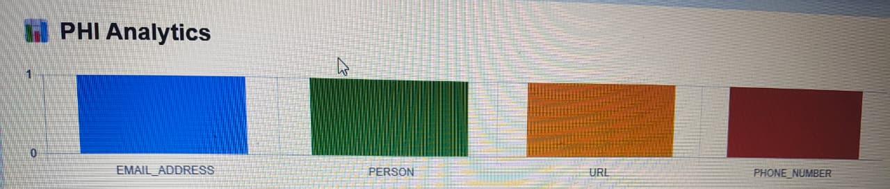
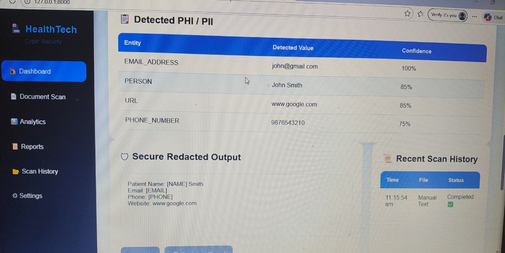
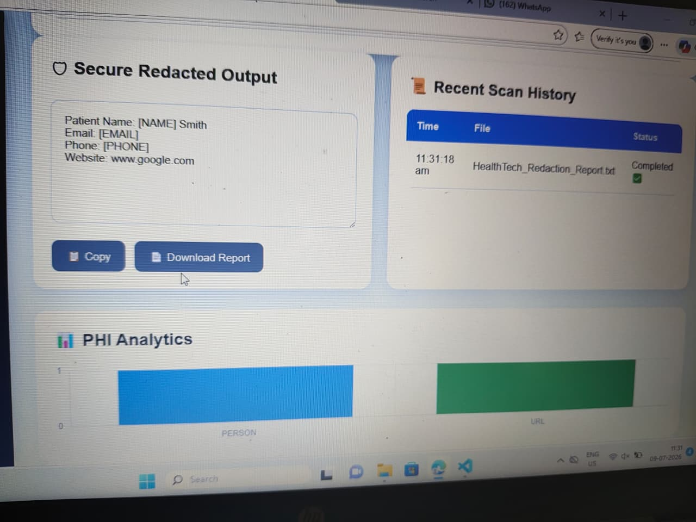

# 🏥 HealthTech - Automated PHI/PII Redaction Pipeline

A secure healthcare privacy protection system that automatically detects and redacts **Protected Health Information (PHI)** and **Personally Identifiable Information (PII)** from clinical text and uploaded healthcare documents before sharing them with AI models or external systems.

---

# 📖 Project Overview

Healthcare organizations process sensitive patient information that must be protected before being shared with AI applications. This project provides an automated PHI/PII redaction pipeline that detects confidential information using **Microsoft Presidio** and **Regex**, replacing sensitive data with secure placeholders while preserving the clinical context.

The application includes an interactive dashboard, document upload support, analytics visualization, scan history, and downloadable reports.

---

# 🎯 Project Objectives

- Detect PHI/PII from healthcare documents.
- Automatically redact sensitive information.
- Protect patient privacy before sharing data with AI systems.
- Provide real-time analytics and security insights.
- Support secure healthcare data processing.

--

## 🔄 System Workflow

```text
              User
                │
                ▼
 Upload PDF/TXT or Enter Clinical Notes
                │
                ▼
         FastAPI Backend
                │
     ┌──────────┴──────────┐
     │                     │
     ▼                     ▼
 Regex Detection    Microsoft Presidio
     │                     │
     └──────────┬──────────┘
                ▼
       PHI/PII Detection
                │
                ▼
      Sensitive Data Redaction
                │
                ▼
 Dashboard Analytics & Reports
```

---

# ✨ Features

- 🔒 PHI & PII Detection
- 🛡️ Automatic Data Redaction
- 📄 TXT File Upload
- 📑 PDF File Upload
- 📊 Analytics Dashboard
- 📈 PHI Analytics Chart
- 📋 Entity Detection Table
- 📜 Recent Scan History
- 📄 Download Redacted Report
- 📋 Copy Redacted Output
- ⚠️ Risk Level Indicator
- ⏱️ Scan Time Monitoring
- ✅ Scan Status Updates
- 📱 Responsive Dashboard UI

---

# 🛠️ Technologies Used

## Backend
- Python
- FastAPI
- Microsoft Presidio
- Regex

## Frontend
- HTML5
- CSS3
- JavaScript
- Chart.js

## Development Tools
- Git
- GitHub
- VS Code

---

# 📂 Project Structure

```text
HealthTech---Automated-phi-pii-Redaction-Pipeline-f/
│
├── api/
│   ├── main.py
│   └── detector.py
│
├── static/
│   ├── css/
│   │   └── style.css
│   └── js/
│       └── script.js
│
├── templates/
│   └── index.html
│
├── uploads/
│
├── images/
│   ├── architecture.jpg
│   ├── dashboard.png
│   ├── analytics.png
│   ├── output.png
│   └── upload.png
│
├── requirements.txt
└── README.md
```

---

# 🚀 Installation

### Clone the Repository

```bash
git clone https://github.com/anusree-2003/HealthTech---Automated-phi-pii-Redaction-Pipeline-f.git
```

### Navigate to the Project Folder

```bash
cd HealthTech---Automated-phi-pii-Redaction-Pipeline-f
```

### Install Dependencies

```bash
pip install -r requirements.txt
```

### Run the Application

```bash
uvicorn api.main:app --reload
```

### Open in Browser

```
http://127.0.0.1:8000
```

---

# 📊 Dashboard Modules

- 🏠 Dashboard
- 📄 Document Upload
- 🛡️ Detect & Redact
- 📊 Analytics
- 📜 Scan History
- 📄 Reports
- ⚠️ Risk Level
- 🔒 Security Summary

---

# 📷 Application Screenshots

## 🖥️ Dashboard



---

## 📊 PHI Analytics



---

## 📄 Redacted Output



---

## 📂 Document Upload



---

# 🔄 Working Flow

1. User uploads a TXT/PDF document or enters clinical notes.
2. FastAPI receives the request.
3. Microsoft Presidio and Regex detect PHI/PII entities.
4. Sensitive information is securely redacted.
5. The dashboard displays:
   - Detected entities
   - Analytics chart
   - Risk level
   - Scan history
   - Redacted output
6. Users can copy or download the generated report.

---

# 👥 Team Responsibilities

| Member | Responsibility |
|---------|----------------|
| **Member 1 (Anusree)** | Backend API Development, Dashboard Integration, Analytics, Scan History, TXT/PDF Upload |
| **Member 2** | NLP-Based PHI/PII Detection |
| **Member 3** | Pseudonymization & Storage |
| **Member 4** | Testing & Documentation |

---

# 👩‍💻 My Contribution

- Developed FastAPI backend integration.
- Connected frontend with backend APIs.
- Implemented the interactive dashboard.
- Added Chart.js analytics visualization.
- Developed the scan history module.
- Integrated TXT and PDF upload functionality.
- Implemented report download and copy features.
- Performed testing, debugging, and code cleanup.

---

# 🎯 Project Outcome

The HealthTech PHI/PII Redaction Pipeline successfully detects and redacts sensitive healthcare information from clinical text and uploaded documents. The application provides an interactive dashboard, analytics visualization, scan history, downloadable reports, and secure document processing, helping protect patient privacy before healthcare data is processed by AI systems.

---

# 📌 Future Enhancements

- Reversible pseudonymization
- Database integration
- OCR support for scanned documents
- User authentication
- Cloud deployment
- Enhanced HIPAA compliance
- Multi-user support

---

# 📜 License

This project was developed as part of a **Cyber Security Internship** for educational and learning purposes.

---

# 🙏 Acknowledgements

We sincerely thank our internship mentors, teammates, and the organization for their valuable guidance and support throughout the successful development of this project.

